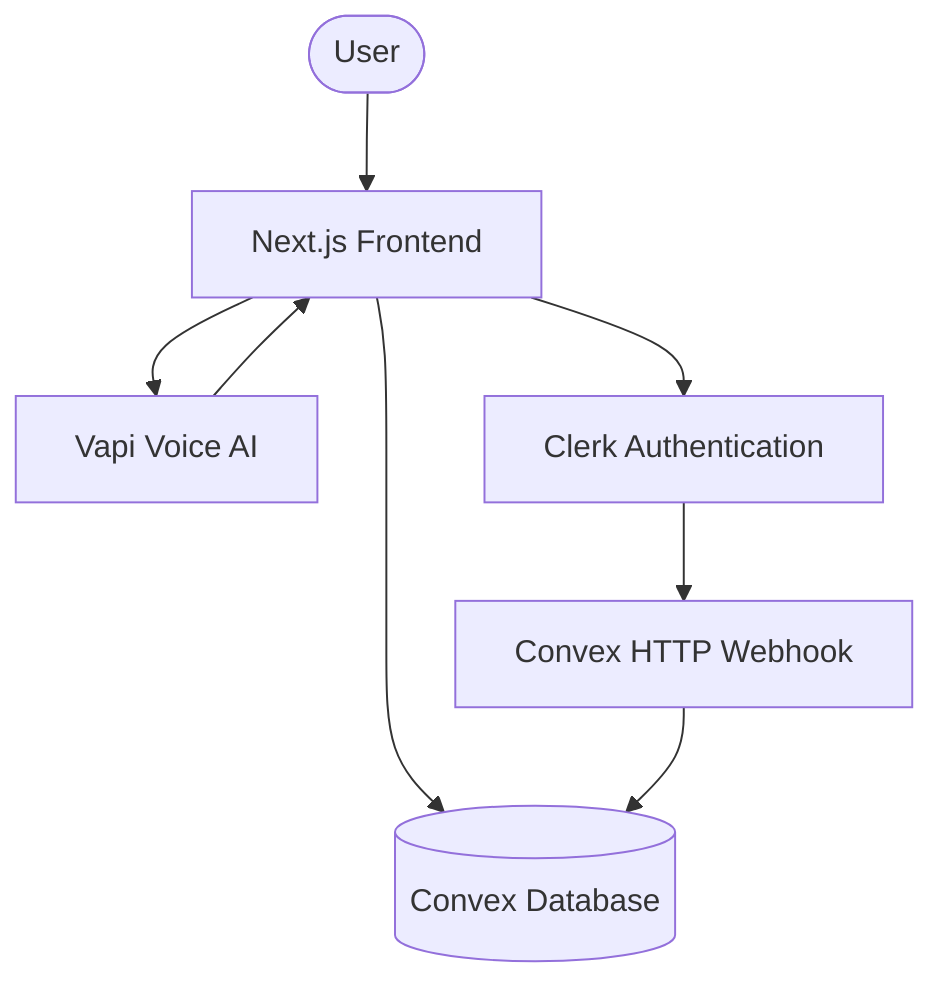
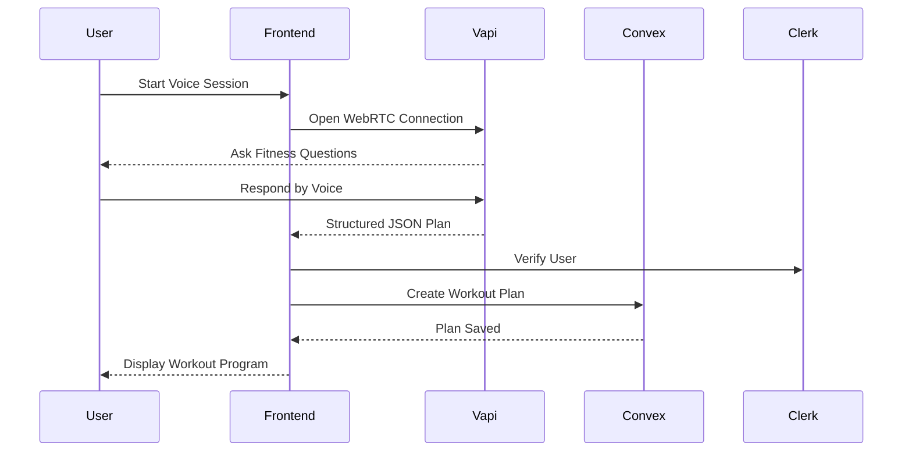
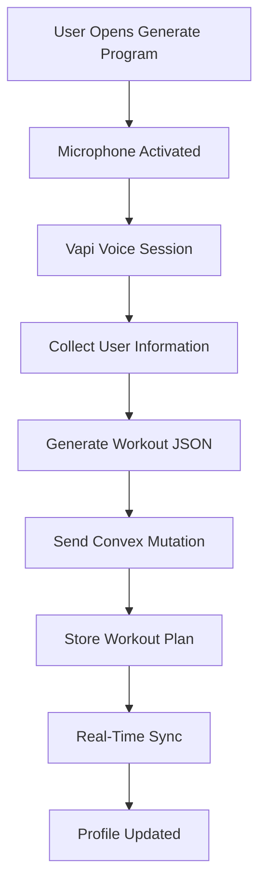
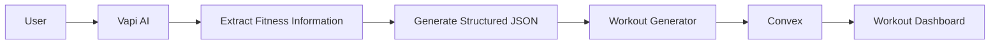
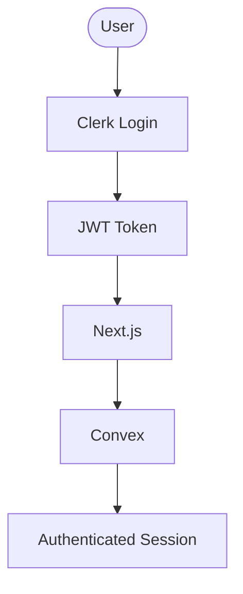
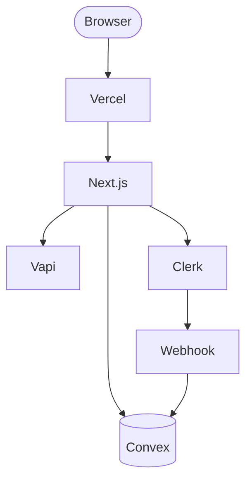

# 🤖 WorkoutAI - Personalized Voice-Interactive Fitness Planner

WorkoutAI is a next-generation AI-powered fitness platform that combines conversational voice AI with real-time cloud synchronization to generate personalized workout programs. Instead of manually filling forms, users simply speak with an AI coach that understands their goals, available equipment, experience level, and physical constraints before producing a customized training plan.

---

## 🌟 Features

## 🌟 Core Features
* **Voice-Driven AI Generation:** Integrates **Vapi** (Voice AI) to allow users to dynamically converse with an AI coach. The AI gathers physical metrics, goals, and constraints to generate a tailored workout program.
* **Immersive UI/UX:** Features a highly stylized, modern interface utilizing custom `CornerElements` and a dynamic `TerminalOverlay` to visualize the AI's "thought process" and plan generation in real-time.
* **Real-Time Data Sync:** Replaces traditional REST APIs with a **Convex** backend, ensuring that generated fitness plans, exercise galleries, and user profiles synchronize across devices instantaneously.
* **Seamless Authentication:** Offloads complex identity management to **Clerk**, wrapping the application in a `ConvexClerkProvider` to ensure secure, JWT-based communication between the frontend and the database.

---

# 🛠 Technology Stack

| Layer | Technologies |
|--------|--------------|
| Framework | Next.js 15, React |
| Language | TypeScript |
| Styling | Tailwind CSS |
| UI Components | Radix UI |
| Backend | Convex |
| Database | Convex Database |
| Authentication | Clerk |
| AI Voice Engine | Vapi |
| Deployment | Vercel |

---

# 🏗 High-Level Architecture



---

# 🎙 Voice Generation Workflow



---

# 🔄 Request Lifecycle



---

# 🧠 AI Conversation Flow



---

# 🔐 Authentication Flow



---

# ☁ Infrastructure



---

# 📂 Project Structure

```text
WorkoutAI
│
├── app
├── components
├── convex
├── hooks
├── lib
├── providers
├── public
├── styles
├── types
├── utils
└── middleware.ts
```

---

# ⚡ Real-Time Features

- Instant workout synchronization
- Automatic UI refresh
- Serverless backend
- Live database subscriptions
- Optimistic updates
- Cross-device synchronization

---

# 🔒 Security

- Clerk Authentication
- JWT Validation
- Protected Convex Mutations
- Secure WebRTC Communication
- Server-side Authorization
- Schema Validation

---

# 📈 Scalability

WorkoutAI is designed using a modern serverless architecture.

- Stateless Next.js frontend
- Convex real-time database
- Event-driven architecture
- Serverless backend
- Automatic scaling
- Global CDN deployment
- Real-time subscriptions
- Zero REST API maintenance

---

# 🚀 Future Improvements

- AI Nutrition Coach
- Exercise Form Analysis
- Wearable Integration
- Health Analytics Dashboard
- Apple Health Integration
- Google Fit Synchronization
- Social Challenges
- AI Meal Planning
- Progress Prediction
- Multi-language Voice Support

---

# 👨‍💻 Author

**Akshat Midha**

Built with ❤️ using

**Next.js • React • Convex • Clerk • Vapi • Tailwind CSS • Radix UI**

